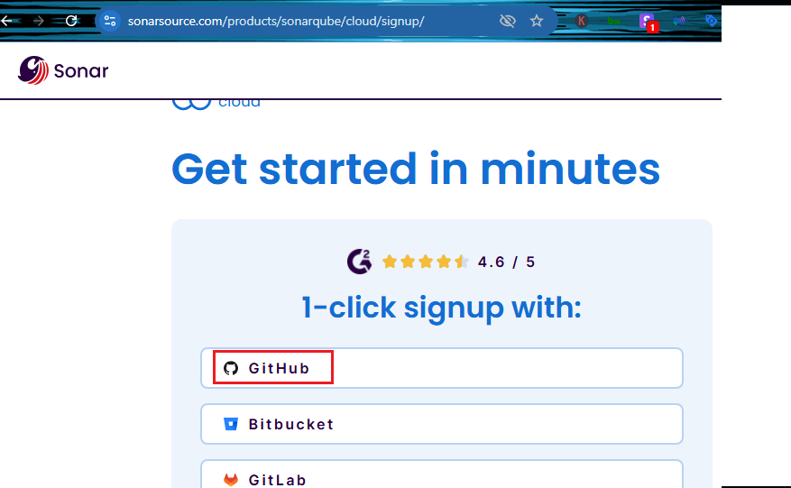
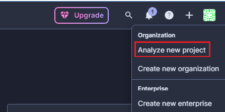
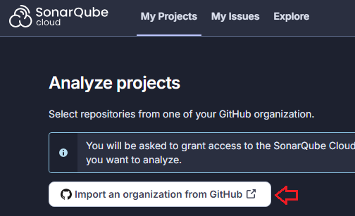
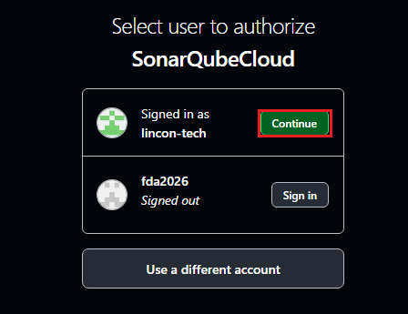
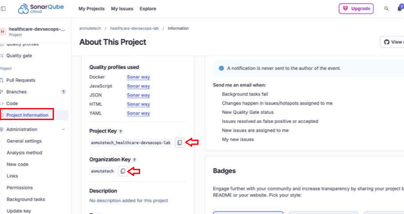
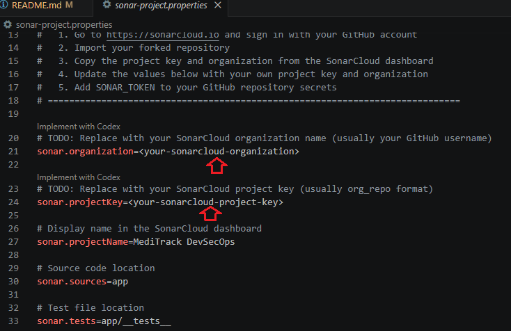
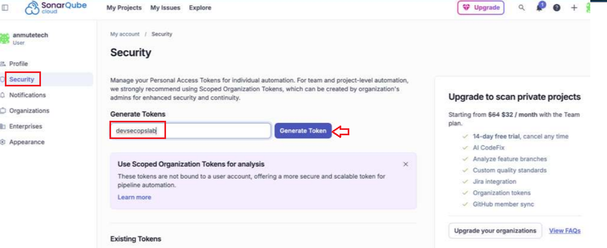
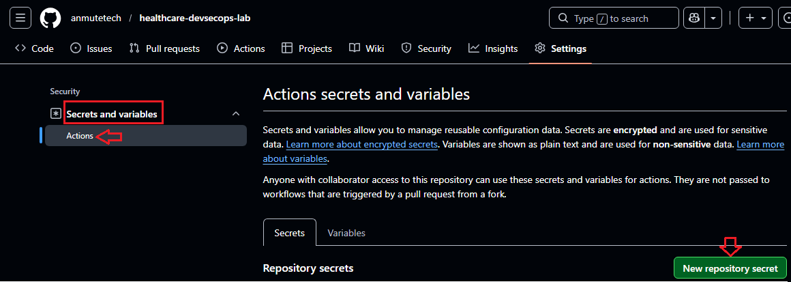
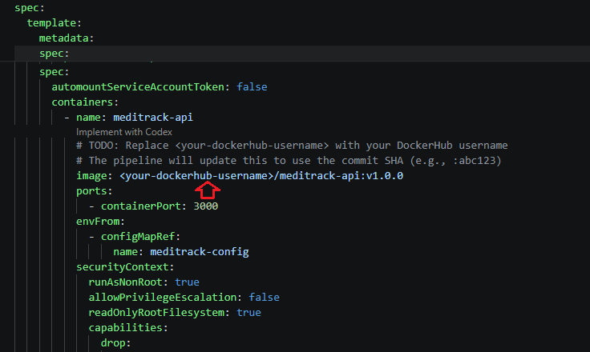
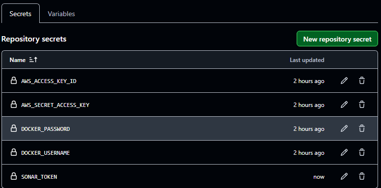

# Healthcare DevSecOps Lab — Securing the MediTrack Pipeline

A hands-on DevSecOps lab that embeds security into every stage of a CI/CD pipeline. Students take the MediTrack patient appointment API from the [Healthcare CI/CD Lab](https://github.com/anmutetech/healthcare-cicd-lab) and layer on 5 security gates using industry-standard tools.

## Scenario

You are a DevOps engineer at **MediTrack Health**. The development team shipped a working CI/CD pipeline (from the previous lab), but the security team has flagged it -- the pipeline has no security checks. In healthcare, this is a compliance risk. Patient data is involved, and regulators expect evidence that code and infrastructure are scanned before reaching production.

Your job is to transform the basic CI/CD pipeline into a **DevSecOps pipeline** by adding:

1. **Secret detection** -- Developers sometimes accidentally commit passwords, API keys, or database credentials into their code. Gitleaks scans the entire history of the repository to find these leaked secrets -- even ones that were "deleted" in a later commit. In healthcare, a leaked database password could expose thousands of patient records.

2. **Code quality and security analysis (SonarCloud)** -- SonarCloud is an industry-standard code quality platform used by thousands of companies worldwide. It performs deep analysis of your code to find bugs, security vulnerabilities (including the OWASP Top 10 -- the ten most critical web application security risks), code smells (code that works but is poorly written and hard to maintain), and duplicated code. It also tracks your **technical debt** -- an estimate of how long it would take to fix all the quality issues. Think of it as a **building health inspection** -- a professional inspector walks through the entire building checking for structural issues, fire hazards, code violations, and maintenance problems, then gives you a report card with a grade (A through E) and a prioritized fix list. In healthcare, SonarCloud helps catch security flaws that manual code review might miss, and gives the team a dashboard to track code quality over time.

3. **Container scanning** -- Our application runs inside a Docker container, which includes an operating system and many system libraries. Trivy scans the entire container image to check whether any of those components have known security flaws (called CVEs -- Common Vulnerabilities and Exposures). If a CRITICAL or HIGH severity issue is found, the deployment is blocked. Think of it as an **X-ray machine** -- before a package enters the building, it gets scanned for anything dangerous hidden inside.

4. **Kubernetes policy enforcement** -- Kubernetes lets you run containers with almost any configuration, but not all configurations are safe. For example, a container running as the "root" (administrator) user is dangerous because if an attacker breaks into it, they have full control. OPA (Open Policy Agent) with Conftest lets us write **rules** that check our Kubernetes configuration files *before* deployment. Think of it as a building code inspection -- before the building (our app) goes live, an inspector (Conftest) checks it against safety codes (our policies) and rejects anything that doesn't comply.

If any check fails, deployment is blocked.

## What Gets Created

- **DevSecOps Pipeline** -- A 7-stage automated workflow in GitHub Actions. 5 of those stages are security and quality checks that must all pass before the application is allowed to deploy. If any single check finds a problem, the pipeline stops and the code never reaches production.
- **SonarCloud Dashboard** -- A web-based dashboard showing your code's overall health: security vulnerabilities, bugs, code smells, test coverage percentage, and technical debt estimate. Your project gets a "quality gate" status -- pass or fail -- that the pipeline checks automatically.
- **OPA Policies** -- A set of rules (written in a language called Rego) that define what a "safe" Kubernetes deployment looks like. For example: containers must not run as an administrator, every container must have memory and CPU limits so one app can't crash the whole server, and every container must have health checks so Kubernetes can restart it if it stops responding.
- **Vulnerability Examples** -- Two files placed side by side: one with 5 common security mistakes (hardcoded passwords, SQL injection, logging patient SSNs, etc.) and one showing the correct, secure way to write the same code. Students study the difference and learn to recognize these patterns in real codebases.
- **Hardened Kubernetes Manifests** -- Deployment configuration that follows security best practices: the container runs as a non-root user, cannot escalate its own privileges, has a read-only filesystem (so attackers can't write malicious files), and drops all Linux capabilities it doesn't need.

## Architecture

```
 ┌─── DevSecOps Pipeline (GitHub Actions) ──────────────────────────────────────────────┐
 │                                                                                       │
 │   ┌───────────────────────────────────────────────────────────────────────────────┐   │
 │   │  Parallel Security Gates (all must pass)                                      │   │
 │   │                                                                               │   │
 │   │  ┌──────────────┐  ┌──────────────────┐  ┌──────────────────┐  ┌───────────┐  │   │
 │   │  │ 1. Unit      │  │ 2. Secret        │  │ 3. Code Quality  │  │ 4. Trivy  │  │   │
 │   │  │    Tests     │  │    Detection     │  │    & Security    │  │  Container│  │   │
 │   │  │              │  │                  │  │                  │  │    Scan   │  │   │
 │   │  │  Jest        │  │  Gitleaks        │  │  SonarCloud      │  │           │  │   │
 │   │  │  ESLint      │  │  (full repo      │  │  (OWASP Top 10   │  │ CRITICAL  │  │   │
 │   │  │  Coverage    │  │   history)       │  │   code smells    │  │ and HIGH  │  │   │
 │   │  │              │  │                  │  │   tech debt      │  │ block     │  │   │
 │   │  │              │  │                  │  │   coverage)      │  │ deploy    │  │   │
 │   │  └──────┬───────┘  └──────┬───────────┘  └──────┬───────────┘  └─────┬─────┘  │   │
 │   │         │                 │                      │                    │        │   │
 │   └─────────┼─────────────────┼──────────────────────┼────────────────────┼────────┘   │
 │             │                 │                      │                    │             │
 │             ▼                 ▼                      ▼                    ▼             │
 │   ┌───────────────────────────────────────────────────────────────────────────────┐   │
 │   │  ┌────────────────────────────────────────────────────────────────────────┐   │   │
 │   │  │ 5. K8s Policy Check (OPA/Conftest)                                    │   │   │
 │   │  │                                                                        │   │   │
 │   │  │  Validates Kubernetes manifests against Rego policies:                 │   │   │
 │   │  │  - runAsNonRoot    - resource limits    - health probes               │   │   │
 │   │  │  - no :latest tag  - no privileged      - no privilege escalation     │   │   │
 │   │  └────────────────────────────────────────────────────────────────────────┘   │   │
 │   └───────────────────────────────────────────────────────────────────────────────┘   │
 │                                                                                       │
 │             All 5 gates pass                                                         │
 │                    │                                                                  │
 │                    ▼                                                                  │
 │   ┌──────────────────────┐         ┌──────────────────────┐                          │
 │   │  6. Build & Push     │────────▶│  7. Deploy to EKS    │                          │
 │   │  Docker image        │         │  kubectl apply       │                          │
 │   │  :latest + :sha      │         │  rollout status      │                          │
 │   └──────────────────────┘         └──────────────────────┘                          │
 │                                                                                       │
 └───────────────────────────────────────────────────────────────────────────────────────┘
```

## Prerequisites

### 1. Complete the Healthcare CI/CD Lab

This lab builds on the [Healthcare CI/CD Lab](https://github.com/anmutetech/healthcare-cicd-lab). Complete that lab first to understand the base application and CI/CD pipeline.

### 2. EKS Cluster

This project deploys to the `migration-eks-cluster` provisioned by the [Cloud Migration Infrastructure](https://github.com/anmutetech/cloud-migration-infra) setup.

Verify your cluster is running:

```bash
kubectl get nodes
```

### 3. DockerHub Account

You need a [DockerHub](https://hub.docker.com/) account to store the container image.

### 4. SonarCloud Account

You need a free [SonarCloud](https://sonarcloud.io) account:

1. Go to [sonarcloud.io](https://sonarcloud.io) and sign in with your GitHub account

2. Click **"+"** > **"Analyze new project"**

3. Import your forked repository


4. **Disable Automatic Analysis** — SonarCloud enables this by default, but it conflicts with our CI-based pipeline analysis. If you skip this step, the pipeline will fail with: *"You are running CI analysis while Automatic Analysis is enabled."*
   - Inside your project on SonarCloud, go to **Administration** (bottom of the left sidebar) > **Analysis Method**
   - Turn **off** the "Automatic Analysis" toggle
   - This tells SonarCloud to only analyze code when our GitHub Actions pipeline sends it, not on its own schedule
5. Copy the **organization** and **project key** from the SonarCloud dashboard

6. Update `sonar-project.properties` with your organization and project key

7. In SonarCloud, go to **My Account** > **Security** > generate a token

8. Add that token as `SONAR_TOKEN` in your GitHub repository secrets


### 5. Tools

```bash
aws --version
kubectl version --client
```

## Setup Guide

### Step 1 — Fork and Clone the Repository

1. Fork this repository to your own GitHub account
2. Clone your fork:

```bash
git clone https://github.com/<your-username>/healthcare-devsecops-lab.git
cd healthcare-devsecops-lab
```

### Step 2 — Update the Docker Image Reference

Edit `kubernetes/deployment.yaml` and replace the image placeholder with your DockerHub username:

```yaml
image: <your-dockerhub-username>/meditrack-api:latest
```


### Step 3 — Update SonarCloud Configuration

Edit `sonar-project.properties` and replace the placeholders:

```properties
sonar.organization=<your-sonarcloud-organization>
sonar.projectKey=<your-sonarcloud-project-key>
```


Commit and push:

```bash
git add kubernetes/deployment.yaml sonar-project.properties
git commit -m "Update Docker image and SonarCloud config"
git push origin main
```

### Step 4 — Configure GitHub Secrets

In your forked repository, go to **Settings** > **Secrets and variables** > **Actions** and add:

| Secret Name | Value |
|---|---|
| `DOCKER_USERNAME` | Your DockerHub username |
| `DOCKER_PASSWORD` | Your DockerHub password |
| `AWS_ACCESS_KEY_ID` | Your IAM user access key ID |
| `AWS_SECRET_ACCESS_KEY` | Your IAM user secret access key |
| `SONAR_TOKEN` | Your SonarCloud token (from Prerequisites step 4, substep 7) |


> **Note:** `GITLEAKS_LICENSE` is optional. Gitleaks works without a license key on public repositories. For private repos, get a free license at [gitleaks.io](https://gitleaks.io).

### Step 5 — Watch the Pipeline Run

The push in Step 3 triggers the pipeline. Go to the **Actions** tab and watch all 7 stages:

1. **Unit Tests** -- Runs the automated test suite to make sure the application works correctly (e.g., "does the patient registration endpoint actually create a patient?")
2. **Secret Detection** -- Scans every commit ever made to the repository looking for accidentally committed passwords, API keys, or tokens. Even if someone deleted the secret in a later commit, it's still in the git history.
3. **Code Quality & Security (SonarCloud)** -- Performs deep analysis of the entire codebase looking for bugs, security vulnerabilities (OWASP Top 10), code smells (code that works but is messy or hard to maintain), and duplicated code. Also tracks test coverage and estimates technical debt (how long it would take to fix all issues). Results appear in the SonarCloud dashboard with a quality gate -- pass or fail.
4. **Container Scan** -- Builds the Docker image and then scans every layer of it (the operating system, system libraries, and app packages) for known vulnerabilities. Blocks deployment if anything CRITICAL or HIGH is found.
5. **K8s Policy Check** -- Validates the Kubernetes configuration files against a set of safety rules *before* deployment. For example: "Is the container running as a non-root user? Does it have memory limits? Does it have health checks?" If any rule is violated, deployment is blocked.
6. **Build & Push** -- Only runs if all 5 checks above pass. Builds the final Docker image and uploads it to DockerHub.
7. **Deploy** -- Deploys the approved, scanned, policy-compliant image to the EKS Kubernetes cluster.

> **Note:** The first run takes approximately 5-8 minutes.

### Step 6 — Explore the SonarCloud Dashboard

After the pipeline completes:

1. Go to [sonarcloud.io](https://sonarcloud.io) and find your project
2. Review the **Quality Gate** status -- this is the pass/fail verdict for your code
3. Explore the dashboard sections:
   - **Bugs** -- Code that is broken or will break (e.g., null pointer dereference)
   - **Vulnerabilities** -- Security flaws from the OWASP Top 10 (e.g., SQL injection, XSS)
   - **Code Smells** -- Code that works but is poorly structured and hard to maintain
   - **Coverage** -- What percentage of your code is covered by automated tests
   - **Duplications** -- Repeated code blocks that should be refactored
   - **Technical Debt** -- An estimate of how long it would take to fix all issues (e.g., "2 hours")
4. Click on any finding to see the exact line of code, an explanation of the problem, and how to fix it

> **SonarCloud will flag issues in `app/vulnerabilities/insecure-example.js`** -- this is intentional! Those vulnerabilities are there for learning purposes. In a real project, you would fix them before merging.

### Step 7 — Explore the Security Results

**Trivy scan results (vulnerabilities in the container image):**
1. In the workflow run, click the **Container Scan (Trivy)** job
2. Review the vulnerability table -- each row shows a CVE ID (a unique identifier for the vulnerability), which package is affected, the current version, the fixed version, and the severity level (CRITICAL, HIGH, MEDIUM, LOW). The pipeline blocks deployment if any CRITICAL or HIGH issues are found.

### Step 8 — Understand the Vulnerability Examples

Review the two files in `app/vulnerabilities/`:

| File | Purpose |
|---|---|
| `insecure-example.js` | **5 intentional vulnerabilities** -- hardcoded credentials, SQL injection, ReDoS, PII in logs, insecure randomness |
| `secure-example.js` | **The fixed versions** -- environment variables, parameterized queries, safe validation, redacted logs, crypto.randomBytes |

These files demonstrate common security mistakes that SonarCloud and code review should catch. In a real healthcare application, any of these could lead to a data breach or HIPAA violation.

### Step 9 — Understand the OPA Policies

Review the files in `policies/`. These are written in a language called **Rego** (pronounced "ray-go"), which is used by OPA (Open Policy Agent) to define rules. You don't need to master Rego -- just understand what each rule checks and why it matters.

**`deployment-policy.rego`** -- Rules for how containers are allowed to run:

| Policy | Plain English | Why It Matters |
|---|---|---|
| Must run as non-root user | The container cannot run as an administrator | If an attacker breaks into a container running as root, they can potentially escape the container and take over the entire server. Running as a regular user limits the damage. |
| Must define resource limits | Every container must declare maximum CPU and memory it can use | Without limits, a single misbehaving app could consume all the server's resources and crash every other app running alongside it -- including other patient-facing services. |
| Must have health probes | The container must tell Kubernetes how to check if it's still working | If an app freezes or crashes silently, Kubernetes needs a way to detect it and automatically restart it. Without probes, a broken app could sit there serving errors to patients. |
| Must not use `:latest` image tag | The container must reference a specific version (e.g., `:v1.2.3` or `:abc123`) | The `:latest` tag is a moving target -- it points to whatever was built most recently. If something breaks, you can't tell which version is running. Using specific tags ensures every deployment is traceable and reproducible. |
| Must not run in privileged mode | The container cannot have full access to the host machine | Privileged containers can see and modify everything on the server, including other containers. This is almost never needed and creates a massive security hole. |
| Must not allow privilege escalation | A process inside the container cannot grant itself more permissions | This prevents an attacker from starting with limited permissions and gradually escalating to full control. |

**`namespace-policy.rego`** -- Rules for how Kubernetes is organized:

| Policy | Plain English | Why It Matters |
|---|---|---|
| Namespaces must have labels | Every namespace must be tagged with identifying information | Labels are how Kubernetes knows which network rules and access controls apply to which apps. Without labels, you can't enforce "only the MediTrack app can talk to the MediTrack database." |
| No deployments in `default` namespace | Apps must be deployed into their own dedicated namespace | The `default` namespace is shared by everyone. Deploying there makes it harder to control who can access what, and increases the risk of one team accidentally affecting another team's services. |

Try breaking a policy to see it fail:

```bash
# Install conftest locally
brew install conftest  # macOS
# or: go install github.com/open-policy-agent/conftest@latest

# Run the policy check
conftest test kubernetes/deployment.yaml -p policies/

# Edit deployment.yaml — remove the readinessProbe, then re-run
conftest test kubernetes/deployment.yaml -p policies/
# Output: FAIL - Container 'meditrack-api' must define a readinessProbe
```

### Step 10 — Verify the Deployment

```bash
kubectl get pods -n meditrack
kubectl get svc -n meditrack
```

Copy the `EXTERNAL-IP` and open it in your browser. You should see the MediTrack dashboard.

Test the API:

```bash
# List patients
curl http://<EXTERNAL-IP>/api/patients

# Check Prometheus metrics
curl http://<EXTERNAL-IP>/metrics
```

### Step 11 — Break and Fix the Pipeline (Challenge)

Try introducing a security issue and watch the pipeline catch it:

1. **Add a hardcoded secret to a route file:**

```javascript
// Add this to app/routes/patients.js
const DB_PASSWORD = 'patient-db-secret-123';
```

2. Commit and push -- watch SonarCloud flag the hardcoded credential

3. **Remove resource limits from the deployment:**

```yaml
# Remove the resources: block from kubernetes/deployment.yaml
```

4. Commit and push -- watch OPA/Conftest block the deployment

5. Fix both issues and push again -- the pipeline should pass and deploy successfully

## Security Tools Reference

| Tool | What It Does (Plain English) | Real-World Analogy | Used By |
|---|---|---|---|
| **Gitleaks** | Scans the entire git history for accidentally committed passwords, API keys, or tokens | A metal detector scanning for things that shouldn't be there | GitLab, Uber, Shopify (17k+ GitHub stars) |
| **SonarCloud** | Analyzes code for bugs, security vulnerabilities (OWASP Top 10), code smells, duplication, and technical debt. Tracks code quality over time with dashboards and quality gates | A professional building health inspector who checks for structural issues, fire hazards, and code violations, then gives you a report card and fix list | Used by 400,000+ organizations including BMW, Siemens, NASA, and most Fortune 500 companies |
| **Trivy** | Scans every layer of a Docker container image for operating system and library vulnerabilities | An X-ray machine scanning a package before it enters the building | Most popular container scanner in the industry (CNCF project) |
| **OPA/Conftest** | Checks Kubernetes configuration files against a set of safety rules before deployment | A building code inspector checking blueprints before construction begins | Netflix, Goldman Sachs, CNCF graduated project |

## Cleanup

Remove the application from your EKS cluster:

```bash
kubectl delete -f kubernetes/servicemonitor.yaml
kubectl delete -f kubernetes/service.yaml
kubectl delete -f kubernetes/deployment.yaml
kubectl delete -f kubernetes/configmap.yaml
kubectl delete -f kubernetes/namespace.yaml
```

> **Note:** To destroy the underlying EKS cluster, follow the cleanup steps in the [Cloud Migration Infrastructure README](https://github.com/anmutetech/cloud-migration-infra).

## Project Structure

```
healthcare-devsecops-lab/
├── .github/workflows/
│   └── devsecops.yml              # 7-stage DevSecOps pipeline
├── .gitleaks.toml                  # Gitleaks configuration (allowlisted paths)
├── sonar-project.properties        # SonarCloud configuration
├── app/
│   ├── package.json               # Dependencies (express, helmet, prom-client, winston)
│   ├── server.js                  # Express server with security middleware
│   ├── logger.js                  # Winston JSON logger
│   ├── .eslintrc.json             # ESLint configuration
│   ├── routes/
│   │   ├── patients.js            # Patient CRUD endpoints
│   │   └── appointments.js        # Appointment scheduling endpoints
│   ├── vulnerabilities/
│   │   ├── insecure-example.js    # 5 intentional vulnerabilities (for learning)
│   │   └── secure-example.js      # Fixed versions of each vulnerability
│   ├── __tests__/
│   │   └── patients.test.js       # Jest test suite (health, patients, appointments)
│   ├── monitoring/
│   │   └── metrics.js             # Prometheus metrics (requests, duration, appointments)
│   └── public/
│       └── index.html             # MediTrack dashboard UI
├── docker/
│   └── Dockerfile                 # Multi-stage build, non-root user, health check
├── kubernetes/
│   ├── namespace.yaml             # meditrack namespace with labels
│   ├── configmap.yaml             # Environment configuration
│   ├── deployment.yaml            # Hardened: securityContext, dropped capabilities, RO filesystem
│   ├── service.yaml               # LoadBalancer service (port 80 → 3000)
│   └── servicemonitor.yaml        # Prometheus ServiceMonitor
└── policies/
    ├── deployment-policy.rego     # OPA: non-root, limits, probes, no :latest, no privileged
    └── namespace-policy.rego      # OPA: labels required, no default namespace
```
